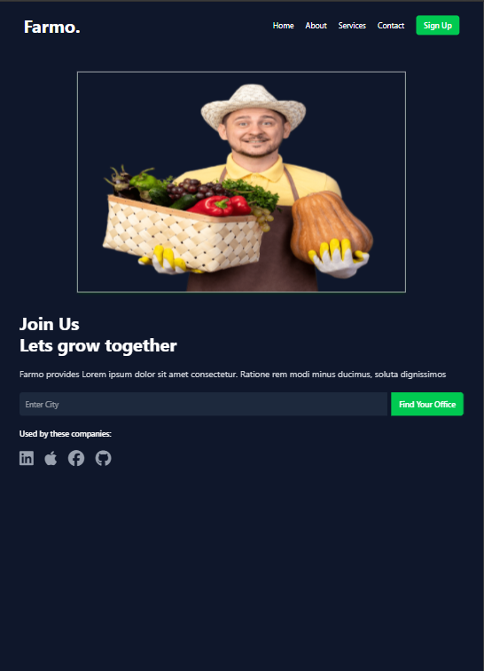

# farmo-TailwindCSS
A responsive, animated landing page for a farmer's app built with **Tailwind CSS**, featuring modern UI components and engaging animations.
 
  
 

Technologies Used
This project uses Tailwind CSS to create a flexible and responsive design with utility-first styling. ScrollReveal adds smooth scroll animations to elements as they appear in the viewport. Font Awesome provides scalable vector icons to enhance the UI. Hypercolor.dev is used to manage and manipulate colors for a vibrant, engaging design.

Features
The app features a fully responsive layout optimized for both desktop and mobile. It incorporates smooth scroll animations, dynamic color schemes, and easy-to-use Font Awesome icons. The design is simple to customize and extend for future improvements.
